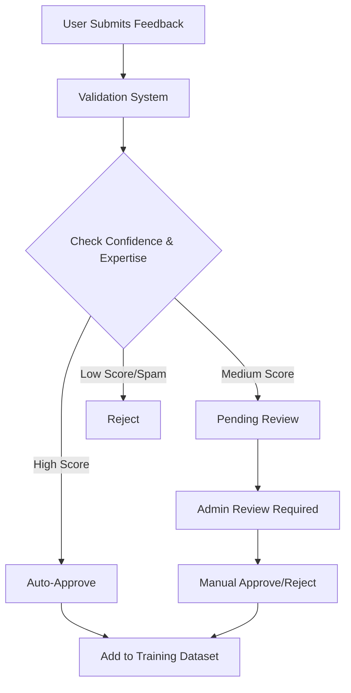

# 🚀 Deployment Guide - AI Phishing Detection System

This guide explains how to deploy your AI Phishing Detection System to Vercel with automatic server connection and validation system.

## 📋 Prerequisites

- GitHub repository with your project
- Vercel account (free tier available)
- Optional: VirusTotal API key for enhanced detection

## 🔧 Vercel Deployment Setup

### 1. Prepare Your Project

Ensure your project structure looks like this:
```
your-project/
├── api/
│   ├── index.py          # Vercel serverless entry point
│   └── requirements.txt  # API dependencies
├── frontend/
│   ├── index.html        # Frontend files
│   ├── script.js
│   └── style.css
├── services/
│   └── detection_engine.py
├── vercel.json          # Vercel configuration
├── main.py              # Local development server
└── requirements.txt     # Full project dependencies
```

### 2. Connect to Vercel

1. **Via Vercel Dashboard:**
   - Go to [vercel.com](https://vercel.com) and sign in
   - Click "New Project"
   - Import your GitHub repository
   - Vercel will auto-detect the configuration

2. **Via Vercel CLI:**
   ```bash
   npm i -g vercel
   vercel login
   vercel --prod
   ```

### 3. Environment Variables Configuration

Set up environment variables in Vercel Dashboard:

1. Go to your project → Settings → Environment Variables
2. Add these variables:

```env
# Required for enhanced detection
VIRUSTOTAL_API_KEY=your_virustotal_api_key

# Validation system settings
VALIDATION_CONFIDENCE_THRESHOLD=80
AUTO_APPROVE_THRESHOLD=80
ENABLE_FEEDBACK_VALIDATION=true

# Performance settings
MAX_CONCURRENT_REQUESTS=100
REQUEST_TIMEOUT=30
```

## 🔄 Automatic Server Connection

### How It Works

The system now automatically connects when deployed:

1. **Local Development**: Uses `http://localhost:8000`
2. **Production**: Uses `/api` routes automatically
3. **Auto-detection**: Frontend detects environment and adjusts API endpoints

### Frontend Environment Detection

The JavaScript automatically detects the environment:

```javascript
const API_BASE_URL = window.location.hostname === 'localhost' 
    ? 'http://localhost:8000' 
    : `${window.location.protocol}//${window.location.host}/api`;
```

### Vercel Serverless Configuration

The `vercel.json` configuration ensures:
- API routes go to `/api/index.py`
- Frontend routes serve static files
- Proper CORS handling
- Environment variables are available

## ✅ Validation System Features

### User Feedback Validation

The new system includes:

1. **Confidence Rating**: Users rate their confidence (1-5)
2. **Expertise Level**: Users select their cybersecurity expertise
3. **Automatic Validation**: High-confidence expert feedback auto-approved
4. **Spam Detection**: Filters out promotional/spam content
5. **Manual Review**: Pending feedback requires admin approval

### Validation Process



### Admin Endpoints

New endpoints for feedback management:

- `GET /api/feedback/pending` - View pending feedback
- `POST /api/feedback/{id}/approve` - Approve feedback
- `POST /api/feedback/{id}/reject` - Reject feedback

## 🚀 Deployment Steps

### Step 1: Repository Setup

1. Push your code to GitHub
2. Ensure all files are in the correct structure
3. Test locally with `python main.py`

### Step 2: Vercel Deployment

1. **Connect Repository:**
   ```bash
   # Via CLI
   vercel --prod
   
   # Or use Vercel Dashboard
   # Import from GitHub
   ```

2. **Configure Build Settings:**
   - Framework Preset: Other
   - Build Command: (leave empty)
   - Output Directory: frontend
   - Install Command: pip install -r api/requirements.txt

### Step 3: Environment Variables

Add in Vercel Dashboard → Settings → Environment Variables:

```env
VIRUSTOTAL_API_KEY=your_actual_api_key
VALIDATION_CONFIDENCE_THRESHOLD=80
AUTO_APPROVE_THRESHOLD=80
ENABLE_FEEDBACK_VALIDATION=true
SPAM_DETECTION_ENABLED=true
```

### Step 4: Custom Domain (Optional)

1. Go to Domains tab in Vercel
2. Add your custom domain
3. Update DNS settings as instructed
4. SSL is automatically configured

## 📊 Monitoring & Management

### Health Checks

Monitor your deployment:
- Health endpoint: `/api/health`
- Statistics: `/api/stats`
- Pending feedback: `/api/feedback/pending`

### Logs and Analytics

Vercel provides:
- Function logs in real-time
- Performance analytics
- Error monitoring
- Usage statistics

## 🔧 Local Development vs Production

### Local Development
```bash
# Start local server
python main.py

# Frontend connects to localhost:8000
# Full ML models loaded
# File-based data storage
```

### Production (Vercel)
```bash
# Serverless functions
# Environment-based configuration  
# Optimized for fast cold starts
# Cloud-based storage ready
```

## 🛠 Troubleshooting

### Common Issues

1. **API Routes Not Working:**
   - Check `vercel.json` configuration
   - Ensure API files are in `/api` directory
   - Verify environment variables

2. **CORS Errors:**
   - Update CORS origins in environment variables
   - Check API endpoint URLs in frontend

3. **Model Loading Issues:**
   - Large ML models may timeout on cold starts
   - Consider model optimization or external hosting

4. **Environment Variables:**
   - Ensure secrets are set in Vercel dashboard
   - Check variable names match code expectations

### Performance Optimization

1. **Cold Start Optimization:**
   ```python
   # Load models on first request, not on import
   def get_detection_engine():
       global detection_engine
       if detection_engine is None:
           detection_engine = HybridDetectionEngine()
       return detection_engine
   ```

2. **Caching Strategy:**
   - Cache model predictions
   - Use Vercel Edge Functions for faster response
   - Implement Redis for persistent caching

## 📈 Scaling Considerations

### Free Tier Limits
- Function execution: 100GB-hours/month
- Bandwidth: 100GB/month
- Requests: Generous limits

### Upgrading Options
- Pro Plan: $20/month per member
- Increased limits and team features
- Priority support

## 🔐 Security Best Practices

1. **API Keys:**
   - Never commit keys to repository
   - Use Vercel environment variables
   - Rotate keys regularly

2. **CORS Configuration:**
   - Restrict origins to your domains
   - Avoid wildcard (*) in production

3. **Rate Limiting:**
   - Implement in API code
   - Use Vercel Pro for DDoS protection

## 🎯 Next Steps

After deployment:

1. **Monitor Performance:** Check function logs and response times
2. **Gather Feedback:** Use the validation system to improve the model
3. **Scale Features:** Add authentication, advanced analytics
4. **Optimize Models:** Based on real usage patterns

## 📞 Support & Resources

- [Vercel Documentation](https://vercel.com/docs)
- [FastAPI Serverless Guide](https://fastapi.tiangolo.com/deployment/vercel/)
- [Project GitHub Repository](your-github-repo-link)

---

**🎉 Your AI Phishing Detection System is now ready for production with automatic server connection and intelligent feedback validation!**